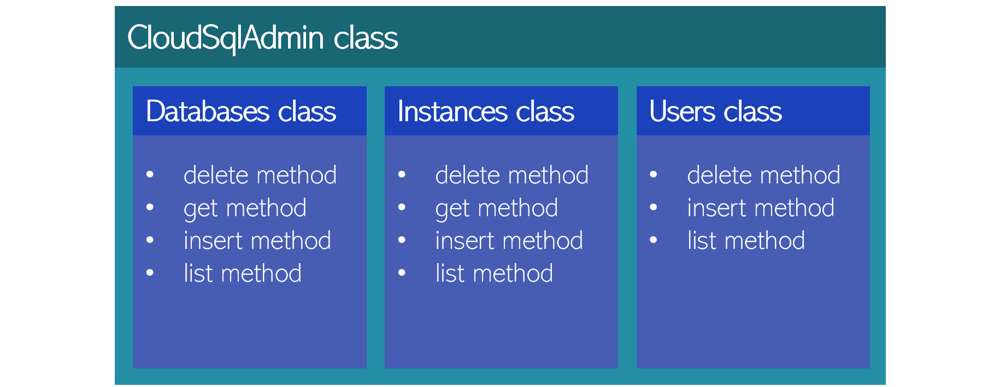

# Python helper class: CloudSqlAdmin

Using the client libraries is definitely simpler than directly calling the REST APIs, but as we've ///just seen, there are still some complexities you need to manage. These range from creating a request body to dealing with pagination, authentication, and other details.

To minimize context switching and distractions, you may find it useful to put together helper functions or classes that abstract away all of those details, so that you can stay hyper-focused on your business logic. In the next section we'll explore one approach to consider: a helper class that turns most Cloud SQL admin API calls into one-liners.

### The CloudSqlAdmin helper class

The ///gcsql_admin.py file in this repo contains a ```CloudSqlAdmin``` class. This class is not a complete wrapper for all of the admin APIs, but it includes methods that simplify the tasks we looked at above as well as a few others. Here's a high-level architectural diagram:



Here's how this wrapper class simplifies the previous example of creating a new user in a Cloud SQL instance:

```python
sql_admin = CloudSqlAdmin()
if sql_admin.user.insert(project, instance, host, username, password):
    print(f"User created: {username}")
else:
    print(f"ERROR inserting user: {sql_admin.response}")
```

There's much less code than in the ///client library example, because the wrapper class has handled creating the request body and other details. If you want to get all of the instances in a project, here's how ```CloudSqlAdmin``` hides the messy details of pagination:

```python
sql_admin = CloudSqlAdmin()
for instance in sql_admin.instance.list(project):
    print(f"Instance: {instance['name']}")
```

You can find a variety of samples for working with ```CloudSqlAdmin``` in the ///samples.py file in this repo. For convenience, those sample use settings from ///config.py for MY_PROJECT and MY_INSTANCE, so you'll need to set those to your own project and instance names to run the samples.

If you'd like to call Cloud SQL Admin APIs that _haven't_ been implemented in the entity-specific classes in CloudSqlAdmin, you can use the ```CloudSqlAdmin.service``` member. The ```tier_list``` function in samples.py provides an example of how to do this:

```python
sql_admin = CloudSqlAdmin()
request = sql_admin.service.tiers().list(project=project)
response: dict = request.execute()
print(response)
```

```CloudSqlAdmin``` is just one of many approaches you could take for simplifying use of the Cloud SQL admin APIs. For example, if you prefer a functional approach you might want to simply create a service resource object (as done in the ```service_client()``` function in ///gcsql_admin.py) and then create helper functions that take this object as an argument in the spirit of dependency injection. Do whatever feels right for you.

A few final things to note about ```CloudSqlAdmin```:

* Since this is intended as a simple educational sample, it doesn't include error handling and other details you'd want to add for production use.
* I've included Python 3 type annotations to clarify some things. These are ignored by the Python interpreter, and you can ignore them as well if you're not accustomed to ///mypy-style type annotations.
* For authentication, there's an ```APP_CREDENTIALS``` setting in ///config.py that stores the name of a local app registration JSON file, and those credentials will be used if the environment variable isn't set. This essentially automates [setting the environment variable](https://cloud.google.com/docs/authentication/getting-started#setting_the_environment_variable), and frees me from need to remember to do that on my dev machine.

