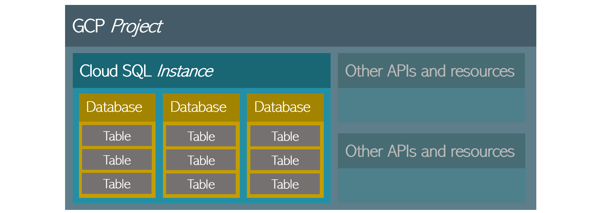

# GCP projects and Cloud SQL instances

For those new to Google cloud services in general, or Cloud SQL in particular, here's a quick overview of the high-level structure of Cloud SQL projects.

### Projects

At the highest level, a _project_ is a logical grouping of APIs and associated settings for billing and authentication. Every GCP resource you use must be in a specific project, and the resources within a single project can be configured to trust one another and use internal networks for low-latency communication.

If you're just trying out some things for your own education, you may find it simplest to create a single project and use it for everything. In a typical business scenario, however, you'll probably have a separate project for each of your applications or services, to simplify management of billing and other details.

Once you've [created a project](https://cloud.google.com/resource-manager/docs/creating-managing-projects), you'll also need to create/register an _application_ that will have access to the project's resources, and for the examples below you'll need to enable the admin API as covered [here](https://console.cloud.google.com/flows/enableapi?apiid=sqladmin).

### Instances

When you use Cloud SQL, you deploy Cloud SQL _instances_ within a project. A [Cloud SQL instance](https://cloud.google.com/sql/docs/mysql/admin-api/v1beta4/instances) is analagous to an installed SQL database product on a server: it includes a chosen SQL engine such as MySQL, Postgres, or SQL Server, as well as configuration options such as replication settings, allocated disk size, and so on.

### Databases

Within each instance, you can create one or more databases. Each database in an instance shares the same configuration options that were set at the instance level. You can currently create [MySQL](https://cloud.google.com/sql/docs/mysql/create-manage-databases) or [PostgreSQL](https://cloud.google.com/sql/docs/postgres/create-manage-databases) databases from the console.

